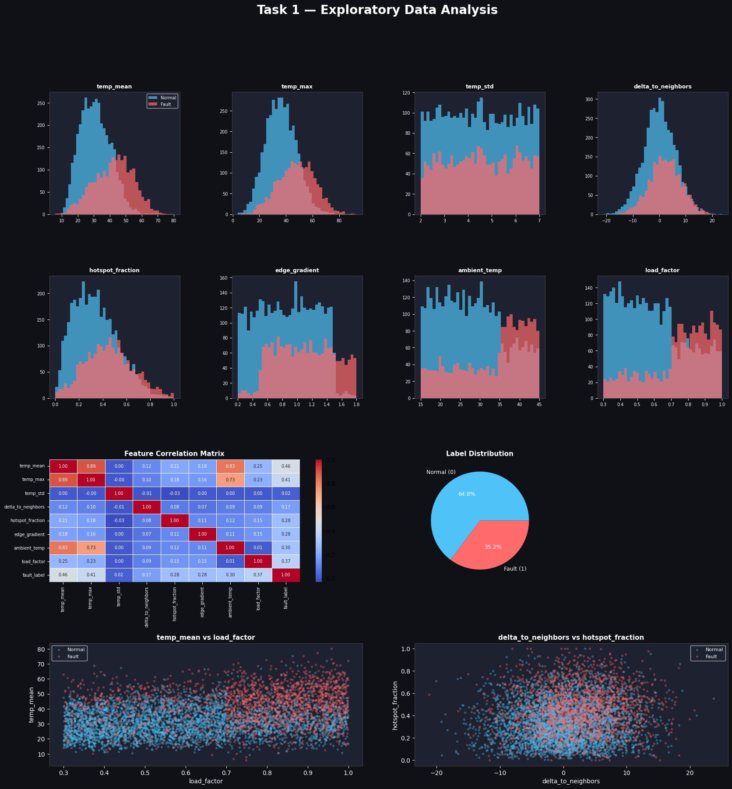
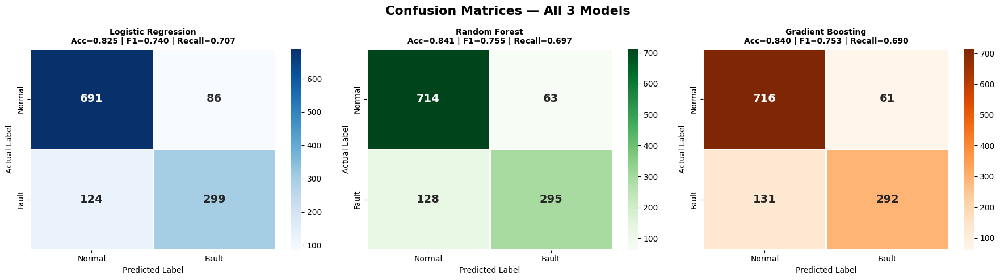
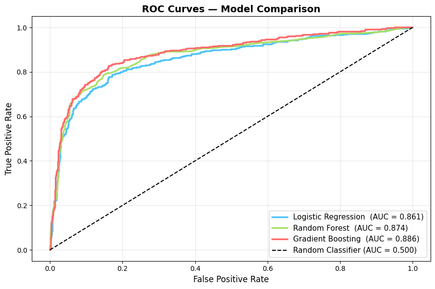
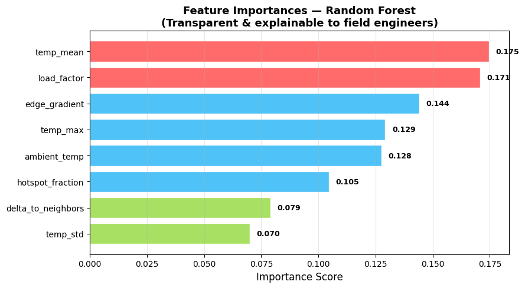
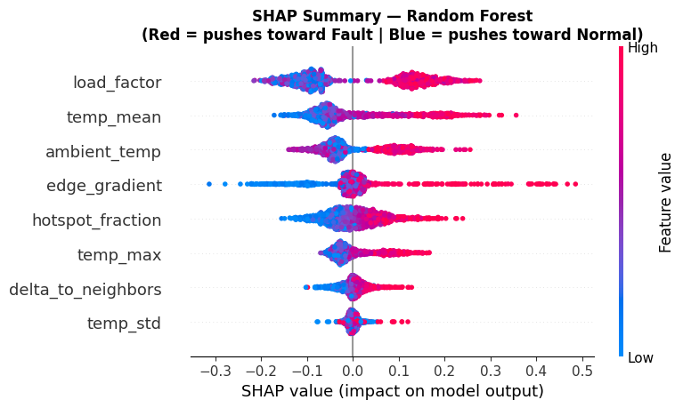
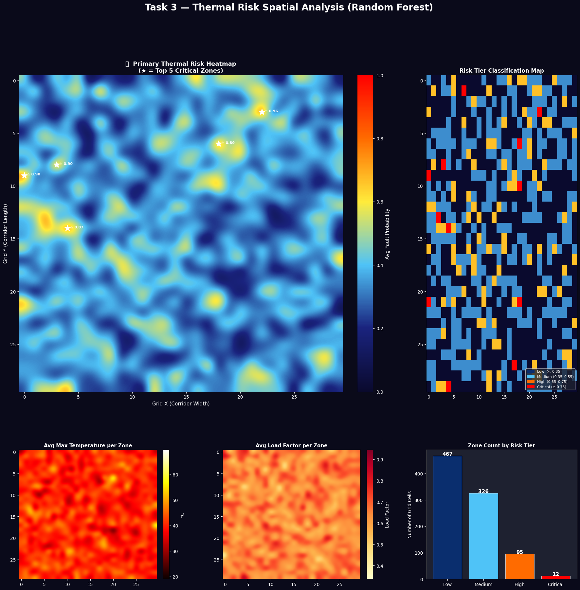
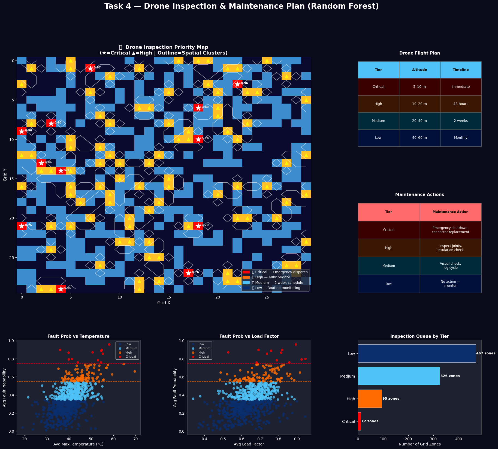

# AI-Based Thermal Powerline Hotspot Detection

> End-to-end AI pipeline for detecting thermal anomalies in power lines and transmission towers using drone-based thermal inspection data.

[](https://colab.research.google.com/github/siddhramesh/thermal-powerline-hotspot-detection/blob/main/thermal_hotspot_detection.ipynb)

---

## Overview

Power lines and towers develop thermal faults due to loose connectors, overloading, and insulation degradation. This project builds an AI pipeline that classifies tile-level thermal features from drone imagery, maps spatial risk zones, and recommends maintenance actions — enabling predictive maintenance before failures occur.

---

## Repository Structure

```
thermal-powerline-hotspot-detection/
│
├── thermal_hotspot_detection.ipynb   ← Main notebook (all 5 tasks)
├── thermal_powerline.csv             ← Dataset (6,000 tiles, 8 features)
├── README.md
│
└── images/
    ├── task1_eda.png
    ├── task2_confusion_matrices.png
    ├── task2_roc_curves.png
    ├── task2_metrics_comparison.png
    ├── task2_feature_importance.png
    ├── task2_shap.png
    ├── task3_spatial_heatmap.png
    ├── task4_drone_plan.png
    └── task5_reflection.png
```

---

## Dataset

| Property | Value |
|---|---|
| Tiles | 6,000 |
| Features | 8 |
| Label | `fault_label` (0 = Normal, 1 = Fault) |
| Class Split | 64.8% Normal / 35.2% Fault |
| Missing Values | None |

| Feature | Description |
|---|---|
| `temp_mean` | Average tile temperature (°C) |
| `temp_max` | Peak temperature in tile (°C) |
| `temp_std` | Temperature variation within tile |
| `delta_to_neighbors` | Temp difference vs adjacent tiles |
| `hotspot_fraction` | % of pixels above hotspot threshold |
| `edge_gradient` | Thermal sharpness at tile boundaries |
| `ambient_temp` | Outdoor air temperature (°C) |
| `load_factor` | Electrical load on line (0–1) |

---

## Tasks

### Task 1 — Data Understanding
Explored all 8 features with distribution plots, correlation heatmap, and label analysis. `temp_mean`, `load_factor`, and `hotspot_fraction` emerged as the strongest fault indicators.



---

### Task 2 — Machine Learning Model
Trained and compared 3 models. Selected **Random Forest** through a 2-step elimination process.

| Model | F1 | Precision | Recall | ROC-AUC |
|---|---|---|---|---|
| Logistic Regression | 0.740 | 0.777 | 0.707 | 0.861 |
| **Random Forest ✅** | **0.755** | **0.824** | **0.697** | **0.874** |
| Gradient Boosting | 0.753 | 0.827 | 0.690 | 0.886 |

**Model Selection Logic:**
```
Logistic Regression → Eliminated: data is non-linear (fault rate jumps 20%→87%
                      across temp ranges) + 37% more false alarms (86 vs 63 FPs)

Gradient Boosting   → Eliminated: ROC-AUC gap is only 0.012 (negligible) +
                      under-calls 7 genuinely critical zones (true fault rate 0.60–1.00)

Random Forest ✅    → Chosen: highest F1, fewer false flags, transparent feature
                      importance, SHAP explainability, higher Recall
```






---

### Task 3 — Spatial Risk Analysis
Aggregated RF predictions across a 30×30 spatial grid representing the power corridor.

| Tier | Zones | Threshold | Action |
|---|---|---|---|
| 🔴 Critical | 12 | ≥ 0.75 | Immediate dispatch |
| 🟠 High | 95 | 0.55–0.75 | 48hr inspection |
| 🔷 Medium | 326 | 0.35–0.55 | 2-week schedule |
| 🔵 Low | 467 | < 0.35 | Routine monthly |



---

### Task 4 — Drone & Maintenance Plan
Recommended drone flight strategies and maintenance actions per risk tier. Spatial clustering detected multiple adjacent High/Critical zones indicating systemic corridor-level overloading.



---

### Task 5 — Reflection
Key limitations and proposed improvements:

| Limitation | Severity | Proposed Fix |
|---|---|---|
| Synthetic dataset | 9/10 | Real thermal imagery + CNN/ViT |
| No GPS coordinates | 8/10 | Georeferenced tiles + Folium maps |
| Single snapshot | 8/10 | Time-series flights + LSTM |
| No weather data | 7/10 | Weather API + SCADA integration |
| No cost weighting | 6/10 | Cost-sensitive learning (FN penalty 5–10×) |


---

## Tech Stack

`Python` `Pandas` `NumPy` `Scikit-learn` `SHAP` `Matplotlib` `Seaborn` `SciPy` `Google Colab` `GitHub`

---

## How to Run

```bash
git clone https://github.com/siddhramesh/thermal-powerline-hotspot-detection.git
```
Then open the notebook in Colab using the badge at the top and run all cells.

---

**Author:** Siddhramesh | Capstone Project — AI-Based Thermal Powerline Hotspot Detection
