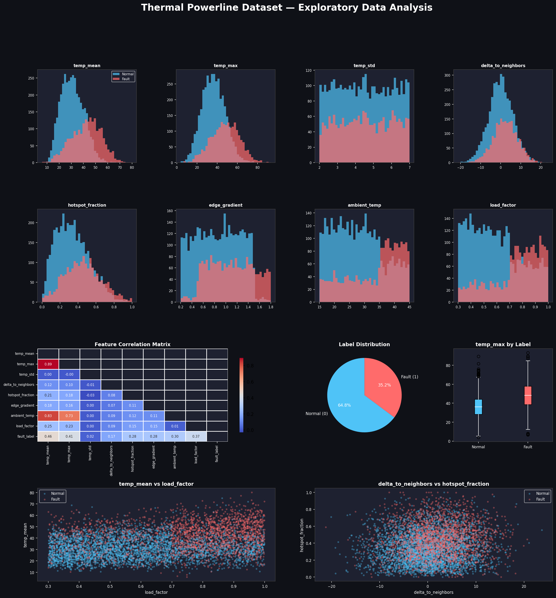
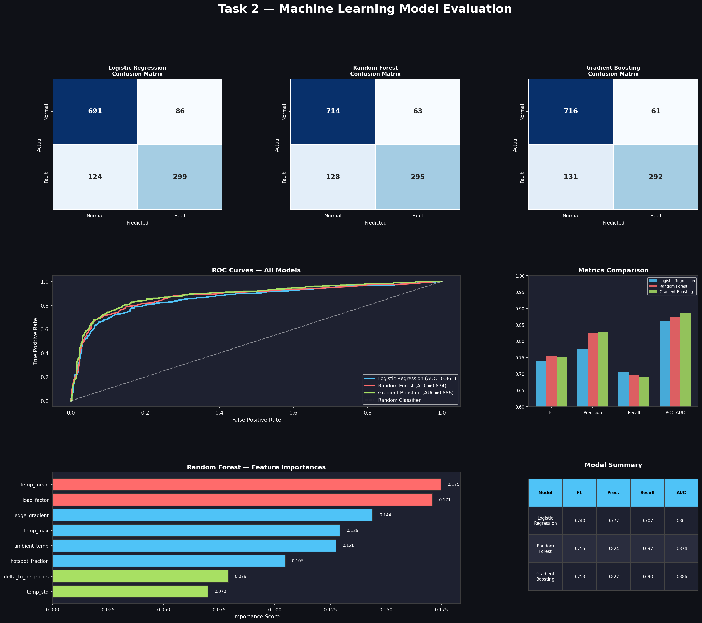
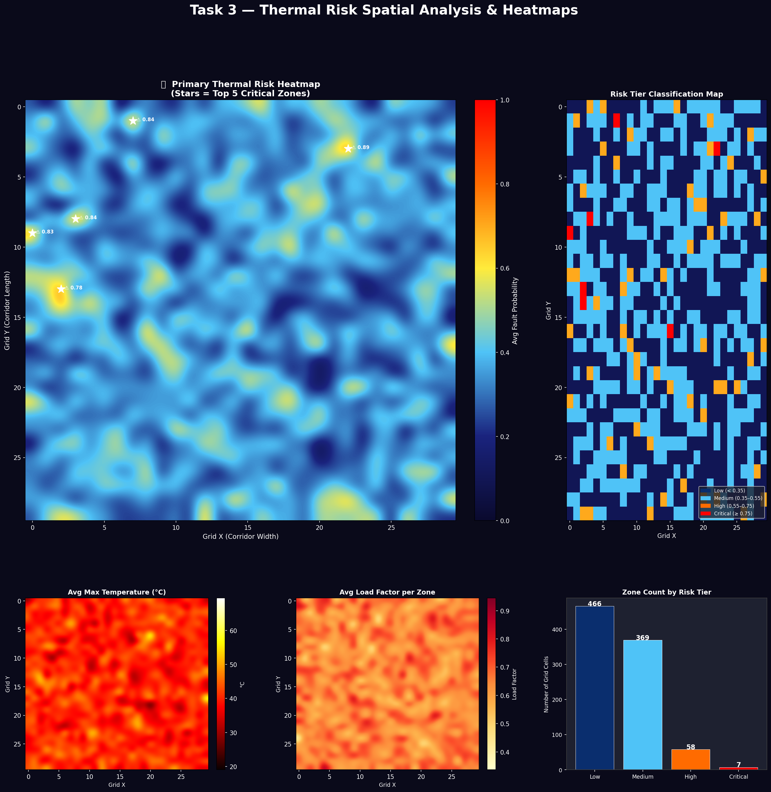
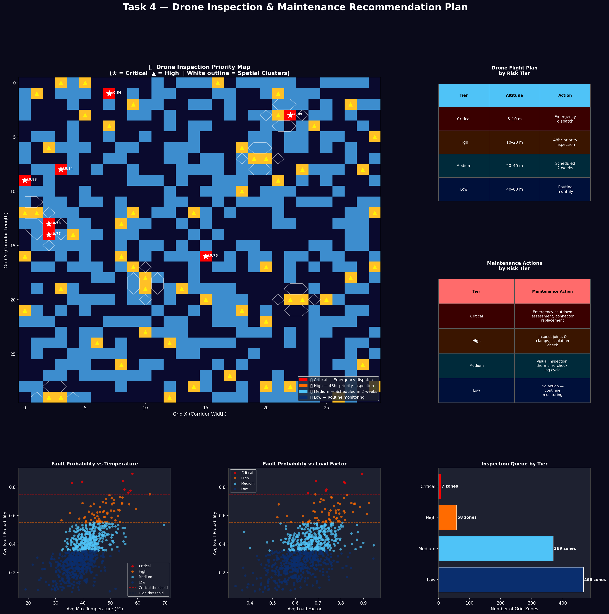
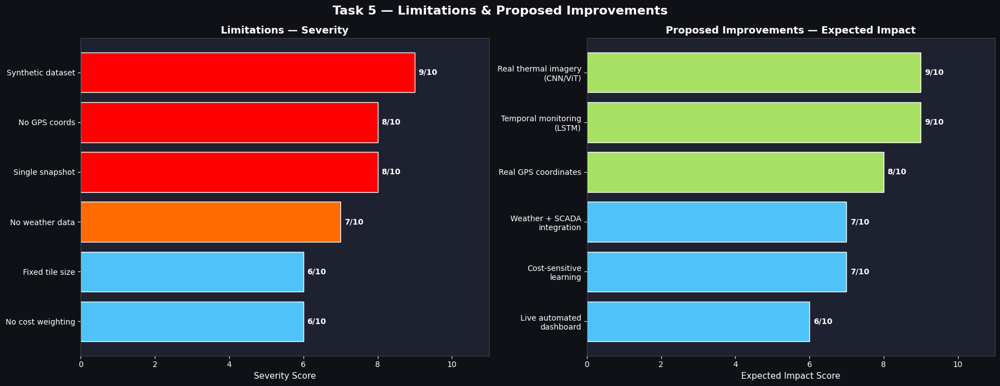

# 🔥 AI-Based Thermal Powerline Hotspot Detection

> An end-to-end AI pipeline for detecting thermal anomalies in power lines and transmission towers using drone-based thermal inspection data.

---

## 📌 Project Overview

Power lines and transmission towers are prone to thermal failures caused by loose connectors, overloading, insulation degradation, and corrosion. Left undetected, these anomalies can lead to equipment failure, wildfires, and large-scale outages.

This capstone project builds a complete **AI-driven inspection pipeline** that:
- Analyzes tile-level thermal features extracted from drone imagery
- Classifies tiles as **normal** or **thermal anomaly** using machine learning
- Aggregates predictions into a **spatial risk heatmap** for corridor-level analysis
- Recommends **drone flight strategies and maintenance actions** based on fault severity

> ⚠️ Note: This project works on pre-extracted thermal features (not raw images), simulating real-world outputs after drone thermal tiling and feature extraction.

---

## 📂 Repository Structure

```
thermal-powerline-hotspot-detection/
│
├── thermal_hotspot_detection.ipynb   ← Main Jupyter Notebook (all 5 tasks)
├── thermal_powerline.csv             ← Dataset (6,000 tiles, 8 features)
├── README.md                         ← Project documentation
│
└── images/
    ├── eda_analysis.png              ← Task 1: EDA & feature distributions
    ├── ml_model_evaluation.png       ← Task 2: Model comparison & evaluation
    ├── spatial_risk_heatmap.png      ← Task 3: Thermal risk heatmaps
    ├── drone_maintenance_plan.png    ← Task 4: Drone inspection plan
    └── task5_reflection.png          ← Task 5: Limitations & improvements
```

---

## 📓 Notebook

👉 **[Open in Google Colab](https://colab.research.google.com/github/siddhramesh/thermal-powerline-hotspot-detection/blob/main/thermal_hotspot_detection.ipynb)**

---

## 📊 Dataset

| Property | Value |
|---|---|
| Total Tiles | 6,000 |
| Features | 8 thermal + operational |
| Label | `fault_label` (0 = Normal, 1 = Fault) |
| Class Distribution | 64.8% Normal / 35.2% Fault |
| Missing Values | None |

### Feature Description

| Feature | Description |
|---|---|
| `temp_mean` | Average tile temperature (°C) |
| `temp_max` | Peak temperature in the tile (°C) |
| `temp_std` | Temperature variation within tile |
| `delta_to_neighbors` | Temperature difference vs adjacent tiles |
| `hotspot_fraction` | % of pixels exceeding hotspot threshold |
| `edge_gradient` | Thermal sharpness at tile boundaries |
| `ambient_temp` | Outdoor air temperature (°C) |
| `load_factor` | Electrical load on line (0–1 scale) |

---

## 🧪 Tasks & Results

### Task 1 — Data Understanding
Explored all 8 features, plotted distributions, correlation heatmap, and label balance. Key finding: `temp_mean`, `temp_max`, and `hotspot_fraction` are the strongest visual separators between normal and fault tiles.



---

### Task 2 — Machine Learning Model
Trained and compared 3 classification models:

| Model | F1-Score | Precision | Recall | ROC-AUC |
|---|---|---|---|---|
| Logistic Regression | 0.740 | 0.777 | 0.707 | 0.861 |
| Random Forest | 0.755 | 0.824 | 0.697 | 0.874 |
| **Gradient Boosting ✅** | **0.753** | **0.827** | **0.690** | **0.886** |

**Chosen Model: Gradient Boosting** — highest ROC-AUC (0.886), best overall discrimination between fault and normal tiles.

> Accuracy alone is insufficient because a model predicting "Normal" for all tiles would achieve 64.8% accuracy while missing every single fault — catastrophic in power infrastructure.



---

### Task 3 — Spatial Risk Analysis & Heatmap
Aggregated model predictions across a 30×30 spatial grid. Generated thermal risk heatmaps showing inspection priority zones.

| Risk Tier | Threshold | Zones |
|---|---|---|
| 🔴 Critical | ≥ 0.75 | 7 |
| 🟠 High | 0.55–0.75 | 58 |
| 🔷 Medium | 0.35–0.55 | 369 |
| 🔵 Low | < 0.35 | 466 |



---

### Task 4 — Drone Inspection & Maintenance Plan
Recommended drone flight strategies and maintenance actions based on hotspot severity and spatial clustering.

| Tier | Drone Altitude | Timeline | Action |
|---|---|---|---|
| 🔴 Critical | 5–10 m | Immediate | Emergency shutdown assessment, connector replacement |
| 🟠 High | 10–20 m | Within 48 hrs | Inspect joints & clamps, insulation check |
| 🔷 Medium | 20–40 m | Within 2 weeks | Visual inspection, thermal re-check |
| 🔵 Low | 40–60 m | Monthly | Routine monitoring |

> 58 spatial clusters of High/Critical zones detected — indicating systemic overloading along specific corridor segments, not just isolated failures.



---

### Task 5 — Reflection
Discussed key dataset limitations and proposed a production-grade improved pipeline.

**Key Limitations:**
- Synthetic/simulated dataset (no real sensor noise or calibration errors)
- No GPS coordinates — spatial grid was simulated
- Single point-in-time snapshot — no temporal fault progression
- No weather/wind data for thermal normalization
- No cost-sensitive learning (false negatives more costly than false positives)

**Proposed Improvements:**
- Real thermal imagery processed with CNN / Vision Transformer
- Time-series data across multiple flights using LSTM models
- Real GPS coordinates for georeferenced risk maps
- Weather API + SCADA load integration
- Cost-sensitive retraining with asymmetric misclassification penalties
- Live automated inspection dashboard with SMS/email alerts



---

## 🛠️ Tech Stack

| Tool | Purpose |
|---|---|
| Python 3 | Core language |
| Pandas / NumPy | Data manipulation |
| Scikit-learn | ML models & evaluation |
| Matplotlib / Seaborn | Visualization |
| SciPy | Spatial cluster detection |
| Google Colab | Development environment |
| GitHub | Version control & hosting |

---

## 🚀 How to Run

1. Clone the repository:
```bash
git clone https://github.com/siddhramesh/thermal-powerline-hotspot-detection.git
```

2. Open the notebook in Google Colab:
   👉 [Click here to open in Colab](https://colab.research.google.com/github/siddhramesh/thermal-powerline-hotspot-detection/blob/main/thermal_hotspot_detection.ipynb)

3. Run all cells from top to bottom (Runtime → Run all)

---

## 👤 Author

**Siddhramesh Diksanggi**  
Capstone Project — AI-Based Power Line & Tower Hotspot Detection Using Thermal Data

---

## 📄 License

This project is for educational purposes as part of a capstone submission.
